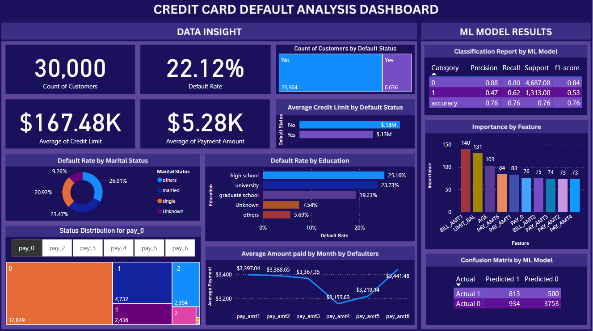

# 💳 Credit Card Default Prediction & Power BI Dashboard

This project investigates behavioral and financial patterns of credit card customers to predict whether they will default on their next payment. It includes data cleaning, EDA, machine learning with XGBoost, and an interactive Power BI dashboard.

---

## 📂 Project Structure

```
├── Images/
│   └── Dashboard.png
│   └── Classification report.png
│   └── confusion matrix.png
│   └── feature_importance.png
├── ML_model/
│   ├── ML_Model_Imp.py
│   └── visualizeMlmodelResults.py
├── cleaned_data/
│   ├── final_data.csv
│   └── working_credit_card_instances_data.csv
├── xgboost_feature_importance.csv
├── model_classification_report.csv
├── confusion_matrix_table.csv
├── credit_card_default_dashboard.pbix
├── credit_card_default_analysis.ipynb
└── README.md
```

---

## 🔎 Exploratory Data Analysis (EDA)

EDA was performed using Python (`pandas`, `seaborn`, `matplotlib`) to explore both categorical and numerical variables:

- **Categorical Variables:** `sex`, `education`, `marriage` were analyzed with bar plots, Chi-square tests, and Cramér's V to determine their relationship with default behavior.
- **Numerical Variables:** `limit_bal`, `pay_0` to `pay_6`, `bill_amt1` to `bill_amt6`, and `pay_amt1` to `pay_amt6` were explored through histograms, boxplots, correlation heatmaps, and t-tests.

---

## 🤖 Machine Learning (XGBoost Classifier)

- **Model Used:** XGBoost Classifier
- **Data Split:** 80% train, 20% test
- **Preprocessing:** StandardScaler applied to all numerical features
- **Feature Importance:** Extracted using `feature_importances_` from the XGBoost model
- **Evaluation Metrics:**

| Metric     | Class 0 (No Default) | Class 1 (Default) |
|------------|----------------------|-------------------|
| Precision  | 0.88                 | 0.47              |
| Recall     | 0.80                 | 0.62              |
| F1-score   | 0.84                 | 0.53              |
| Accuracy   | 76%                  |                   |

---

### 🔑 Top Predictive Features (XGBoost)

These features contributed the most to model predictions:

1. `BILL_AMT1`  
2. `LIMIT_BAL`  
3. `AGE`  
4. `PAY_AMT1`  
5. `PAY_0`

---

## 📊 Power BI Dashboard



### Key Visuals:

- **KPI Cards**: Default rate, customer count, avg. credit limit, avg. payment
- **Bar & Treemap Charts**: Default rate by marital status, education, and repayment status
- **Feature Importance**: Top 10 features from XGBoost model
- **Confusion Matrix**: Model performance breakdown
- **Prediction Summary**: Actual vs. Predicted defaults chart

---

### 📘 DAX Measures Used

```DAX
-- Count of Customers
Count of Customers = COUNTROWS('final_data')

-- Default Rate
Default_Rate = DIVIDE(
    CALCULATE(COUNTROWS('final_data'), 'final_data'[default payment next month] = 1),
    COUNTROWS('final_data')
)
```

## 📈 Key Insights

- **Delayed Repayments (pay_0 to pay_6)** are the strongest indicators of default. Defaulters consistently had more payment delays.
- **Defaulters paid ~2,000–3,000 less per month** across all `pay_amt` columns.
- **Lower credit limits** were commonly observed among defaulters, making them more financially constrained.

---

## 🛠 Tools Used

| Step             | Tools Used                           |
|------------------|--------------------------------------|
| Data Analysis    | Python (pandas, seaborn, matplotlib) |
| Modeling         | XGBoost, scikit-learn                |
| Dashboard        | Power BI                             |
| Data Storage     | CSV, Excel                           |

---

## 🧩 How to Run

1. Run `credit_card_default_analysis.ipynb` to reproduce EDA and model training.
2. Open `credit_card_default_dashboard.pbix` in Power BI Desktop.
3. Refresh data sources to link with updated CSVs if needed.

---
## 📜 License

This project is open-source and available under the MIT License.

---
